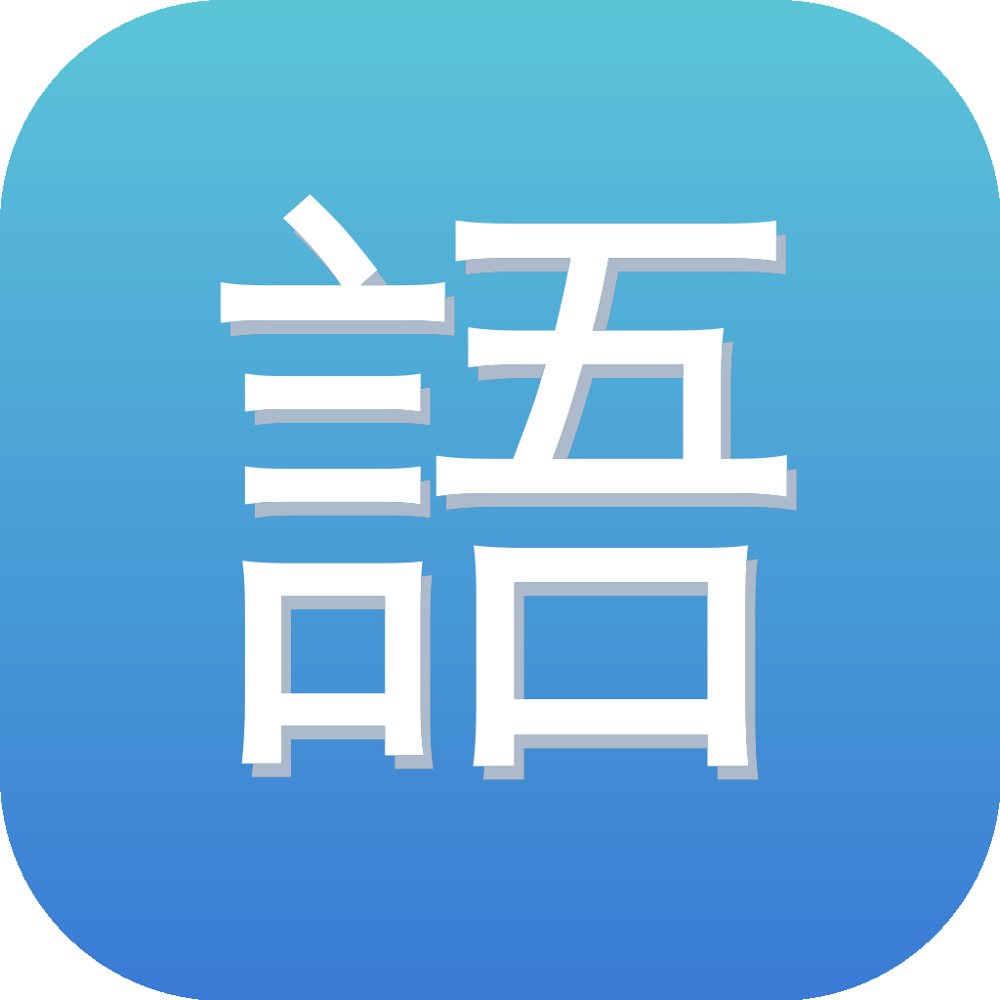

<div align="center">



# ukabu-n1 · N1/N2 悬浮单词便签

一个常驻桌面的 **JLPT N1 / N2 单词悬浮便签**（原生 macOS / AppKit）。
摸鱼时瞄一眼就背词 —— 滚动记忆 + 频度加权 + 例句 + 「会了」一键淘汰。

</div>

## ✨ 特性

- **无边框毛玻璃便签**，常驻置顶，可拖到任意角落（记住位置）
- **滚动记忆**：面前固定滚动 10 个词，某词出现满 10 遍即「毕业」，自动换入一个新词（一次一个），记得住
- **频度加权**：高频词每轮出现 3 次、中频 2 次、低频 1 次，且更早被引入 —— 把时间花在最该背的词上
- **N1 + N2 混背**：按 N1∶N2 ≈ 2∶1 加权（N1 也考 N2 内容），每词标注级别
- **例句**：每个词附日文例句 + 中文翻译
- **「✓ 会了」按钮**：点了就标记已掌握、**永不再现**，进度持久保存
- **自动轮播**，可调速；单击换下一个；右键菜单（暂停 / 快慢 / 重置 / 退出）
- 进度（state.json）、位置与速度（config.json）本地保存，关了重开接着学

## 📦 下载安装（推荐）

到 [Releases](https://github.com/M0025/ukabu-n1/releases) 按芯片下载，打开后把 **ukabu-n1** 拖进 Applications 即可。词库首次启动会自动联网获取。

- Apple Silicon (M 系列) → `ukabu-n1-arm64.dmg`
- Intel → `ukabu-n1-intel.dmg`

>
> 未签名（个人开源项目），首次打开若被 Gatekeeper 拦下，**右键点 app → 打开 → 再点「打开」**；或终端跑一次：
> ```bash
> xattr -dr com.apple.quarantine /Applications/ukabu-n1.app
> ```

## 🚀 从源码运行 / 开发

需要 macOS + Python 3。

```bash
git clone https://github.com/M0025/ukabu-n1.git
cd ukabu-n1

python3 -m venv .venv
.venv/bin/pip install -r requirements.txt

python build_data.py        # 本地生成词库 words.json（N1 + N2）
./run.sh                    # 启动
```

> 提示：tkinter 在新版 macOS 上对无边框/透明支持有问题，本项目用原生 **AppKit (PyObjC)** 绘制，因此依赖 `pyobjc-framework-Cocoa`。

### 开机自启（可选）

```bash
bash install/setup-autostart.sh
```

> dmg 安装的用户：把 ukabu-n1 加进 **系统设置 → 通用 → 登录项** 即可开机自启。

### 打包发布

```bash
pip install py2app
bash scripts/release.sh        # 产物 dist/ukabu-n1.app + dist/ukabu-n1.dmg
```

打 tag（`git tag v1.0.0 && git push --tags`）会触发 GitHub Actions 自动打包并发 Release。

## 🕹 操作

| 操作 | 效果 |
|------|------|
| 拖动 | 移动便签（记住位置）|
| 单击 | 换下一个词 |
| ✓ 会了 | 标记已掌握，永不再现 |
| 右键 | 暂停 / 下一个 / 快一点 / 慢一点 / 重置进度 / 退出 |

## 🙏 致谢 / 数据来源

- 词库数据来自开源 Anki 卡组 **egg rolls JLPT10k**（[5mdld/anki-jlpt-decks](https://github.com/5mdld/anki-jlpt-decks)），以 **CC BY-NC 4.0** 授权，版权归原作者。本 app **不内置词库**：首次启动 / 「更新词库」时从上游源即时获取并存到 `~/Library/Application Support/ukabu-n1/`——这样原作者更新后你重启即得最新版。请勿将本数据用于商业用途。
- 图标为 AI 生成的原创素材。

## 📄 License

[MIT](LICENSE) © 2026 Misko
